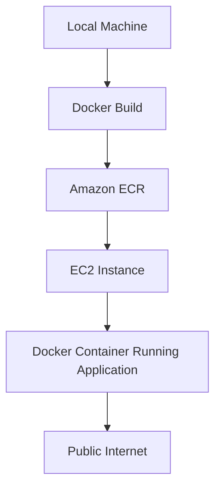

# 🚀 EC2 Containerized Deployment  
### Docker • Amazon ECR • EC2 • IAM • Terraform

<p align="center">
  
  
  
  
</p>

---

# ✨ Overview

This module demonstrates a production-style containerized deployment of a backend application using Docker, Amazon ECR, and Amazon EC2 provisioned via Terraform.

The objective is to:

- Containerize an application
- Push the image to Amazon ECR
- Provision EC2 infrastructure using Terraform
- Deploy the container automatically via EC2 user data
- Expose the service publicly over HTTP

---

# 🏗️ Architecture



---

# 🐳 Docker Containerization

## Base Image Strategy

- Node 20 Alpine
- Production dependency install
- Optimized image size
- Stateless container design

## Build Process

```bash
docker build --no-cache -t app-image .
```

## Image Versioning

```bash
git rev-parse --short HEAD
docker tag app-image <ECR_URI>:<COMMIT_SHA>
docker push <ECR_URI>:<COMMIT_SHA>
```

Immutable tagging ensures reproducible deployments.

---

# 📦 Amazon ECR Integration

## Create Repository

```bash
aws ecr create-repository --repository-name app-repo --region <region>
```

## Authenticate Docker

```bash
aws ecr get-login-password --region <region> \
| docker login --username AWS --password-stdin <ECR_URI>
```

## Push Image

```bash
docker push <ECR_URI>:<COMMIT_SHA>
```

---

# ☁️ Infrastructure Provisioning (Terraform)

## Resources Created

- EC2 Instance (t2.micro)
- IAM Role (ECR ReadOnly)
- IAM Instance Profile
- Security Group (SSH + HTTP)
- Default VPC + Subnet Integration
- User Data Bootstrapping Script

---

## Terraform Initialization

```bash
terraform init
```

## Plan

```bash
terraform plan -var="key_name=<KEY_NAME>" -var="image_tag=<COMMIT_SHA>"
```

## Apply

```bash
terraform apply -var="key_name=<KEY_NAME>" -var="image_tag=<COMMIT_SHA>"
```

---

# 🔐 Security Configuration

## IAM Role

Attached Policy:

```
AmazonEC2ContainerRegistryReadOnly
```

## Security Group Rules

Inbound:
- Port 22 (SSH)
- Port 80 (HTTP)

Outbound:
- Allow all (default)

---

# ⚙️ EC2 User Data Automation

The EC2 instance bootstraps automatically:

```bash
#!/bin/bash
yum update -y
yum install docker -y
service docker start
aws ecr get-login-password --region <region> \
| docker login --username AWS --password-stdin <ECR_URI>
docker pull <ECR_URI>:<COMMIT_SHA>
docker run -d -p 80:1337 <ECR_URI>:<COMMIT_SHA>
```

This enables automated first-time deployment without manual SSH commands.

---

# 🚀 Deployment Workflow

```text
Developer Code
   ↓
Docker Build
   ↓
Tag with Git SHA
   ↓
Push to ECR
   ↓
Terraform Provision EC2
   ↓
EC2 Pulls Image
   ↓
Container Starts Automatically
   ↓
Application Available via Public IP
```

---

# 🌍 Public Access

```
http://<EC2_PUBLIC_IP>
```

---

# 📁 Module Structure

```
01-Containerized-Deployment-EC2/
│
├── Dockerfile
├── terraform/
│   ├── main.tf
│   ├── variables.tf
│   ├── outputs.tf
│   └── userdata.sh
└── README.md
```

---

# 🧠 Engineering Concepts Demonstrated

- Containerization using Docker
- Cloud image registry (ECR)
- Infrastructure as Code (Terraform)
- IAM least privilege model
- Security group network control
- Immutable deployment via version tagging
- Automated bootstrapping via EC2 user data

---

# 🔄 Future Enhancements

- Elastic IP allocation
- Auto-scaling group
- Application Load Balancer
- HTTPS via ACM + Nginx
- CI/CD pipeline integration
- ECS Migration

---

# 🏁 Conclusion

This deployment demonstrates real-world containerized cloud infrastructure where application packaging, registry management, and compute provisioning are fully automated using Infrastructure-as-Code principles.

The system reflects production engineering practices emphasizing immutability, security, and reproducibility.

