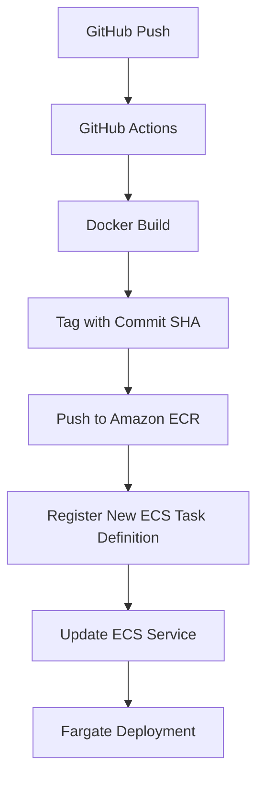

# 🚀 AWS ECS Fargate CI/CD Deployment Pipeline

<p align="center">
  
  
  
  
</p>

---

## 📌 Overview

This project implements a **production-grade CI/CD pipeline** that automatically:

- 🐳 Builds a Docker image
- 🏷 Tags it with the GitHub Commit SHA
- 📦 Pushes it to Amazon ECR
- 🔄 Dynamically updates the ECS Task Definition
- 🚀 Deploys to Amazon ECS (Fargate)
- ♻️ Triggers rolling deployment

Every push to the `main` branch results in a fully automated deployment.

---

## 🧠 Architecture



---

## 🏗 Infrastructure Components

| Component | Description |
|------------|-------------|
| Amazon ECR | Stores container images |
| ECS Cluster | Container orchestration |
| ECS Task Definition | Blueprint for containers |
| ECS Service | Maintains desired task count |
| IAM Execution Role | Allows ECS to pull images |
| GitHub Actions | CI/CD automation engine |

---

## 📂 Project Structure

```
.
├── Dockerfile
├── requirements.txt / server.js
├── main.py (if Python)
└── .github
    └── workflows
        └── deploy.yml
```

---

## 🐳 Dockerfile Example (Python)

```dockerfile
FROM python:3.11-slim

WORKDIR /app

COPY requirements.txt .
RUN pip install --no-cache-dir -r requirements.txt

COPY . .

EXPOSE 8000

CMD ["uvicorn", "main:app", "--host", "0.0.0.0", "--port", "8000"]
```

---

## ⚙ GitHub Actions Workflow

```yaml
name: Deploy to ECS

on:
  push:
    branches:
      - main

env:
  AWS_REGION: ${{ secrets.AWS_REGION }}
  ECR_REPOSITORY: ${{ secrets.ECR_REPOSITORY }}
  ECS_CLUSTER: ${{ secrets.ECS_CLUSTER }}
  ECS_SERVICE: ${{ secrets.ECS_SERVICE }}

jobs:
  deploy:
    runs-on: ubuntu-latest

    steps:
      - name: Checkout
        uses: actions/checkout@v4

      - name: Configure AWS Credentials
        uses: aws-actions/configure-aws-credentials@v4
        with:
          aws-access-key-id: ${{ secrets.AWS_ACCESS_KEY_ID }}
          aws-secret-access-key: ${{ secrets.AWS_SECRET_ACCESS_KEY }}
          aws-region: ${{ env.AWS_REGION }}

      - name: Login to ECR
        uses: aws-actions/amazon-ecr-login@v2

      - name: Build, Tag & Push Docker Image
        run: |
          IMAGE_TAG=${{ github.sha }}

          docker build -t $ECR_REPOSITORY:$IMAGE_TAG .

          docker tag $ECR_REPOSITORY:$IMAGE_TAG \
          ${{ secrets.AWS_ACCOUNT_ID }}.dkr.ecr.$AWS_REGION.amazonaws.com/$ECR_REPOSITORY:$IMAGE_TAG

          docker push \
          ${{ secrets.AWS_ACCOUNT_ID }}.dkr.ecr.$AWS_REGION.amazonaws.com/$ECR_REPOSITORY:$IMAGE_TAG

      - name: Update Task Definition & Deploy
        run: |
          IMAGE_TAG=${{ github.sha }}

          TASK_DEF=$(aws ecs describe-task-definition --task-definition my-task)

          echo "$TASK_DEF" > task.json

          jq --arg IMAGE "${{ secrets.AWS_ACCOUNT_ID }}.dkr.ecr.$AWS_REGION.amazonaws.com/$ECR_REPOSITORY:$IMAGE_TAG" \
          '.taskDefinition.containerDefinitions[0].image=$IMAGE |
           .taskDefinition |
           del(.taskDefinitionArn,.revision,.status,.requiresAttributes,.compatibilities,.registeredAt,.registeredBy)' \
           task.json > new-task.json

          aws ecs register-task-definition --cli-input-json file://new-task.json

          aws ecs update-service \
            --cluster $ECS_CLUSTER \
            --service $ECS_SERVICE \
            --force-new-deployment
```

---

## 🔐 Required GitHub Secrets

```
AWS_ACCESS_KEY_ID
AWS_SECRET_ACCESS_KEY
AWS_REGION
AWS_ACCOUNT_ID
ECR_REPOSITORY
ECS_CLUSTER
ECS_SERVICE
```

---

## 🚀 Deployment Flow

1. Developer pushes code to `main`
2. GitHub Actions workflow triggers
3. Docker image built & tagged with commit SHA
4. Image pushed to Amazon ECR
5. ECS Task Definition updated
6. ECS Service redeploys container
7. New version becomes active

---

## 💡 DevOps Concepts Demonstrated

- Immutable Deployments
- SHA-based Versioning
- Infrastructure Automation
- Continuous Deployment
- Secure Credential Management
- Cloud-Native Architecture
- Container Orchestration
- Production CI/CD Pipelines

---

## 🎯 Resume Impact

This project demonstrates hands-on experience with:

- Amazon ECS (Fargate)
- Amazon ECR
- Docker
- GitHub Actions
- CI/CD Automation
- Cloud Deployment Strategies

---

## 🏁 Conclusion

This repository represents a **modern, scalable, and production-ready container deployment pipeline**.

Every commit results in a deterministic, versioned, and automated cloud deployment — aligning with industry DevOps best practices.


