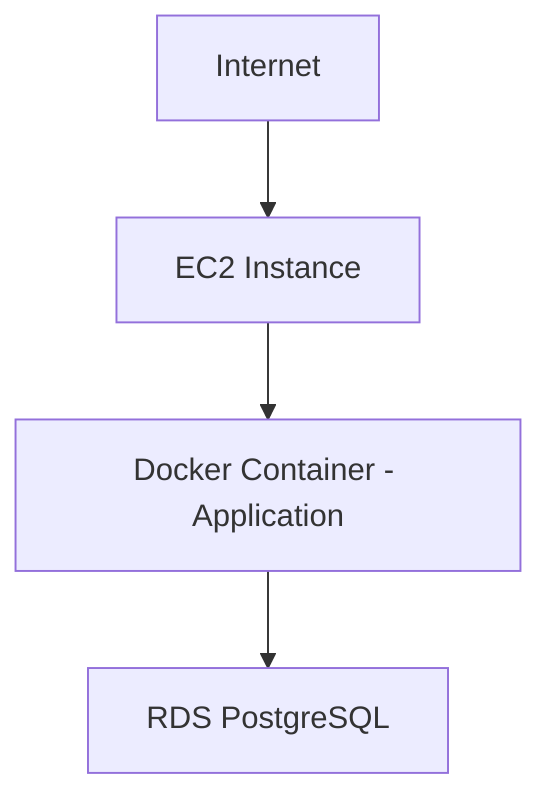

# 🛢️ RDS PostgreSQL Integration  
### Secure Database Architecture • SSL Connectivity • AWS Networking • Terraform

<p align="center">
  
  
  
  
</p>

---

# ✨ Overview

This module upgrades a containerized EC2 deployment by integrating a managed Amazon RDS PostgreSQL database.

The objective is to:

- Replace local SQLite database with managed PostgreSQL
- Provision RDS via Terraform
- Establish secure connectivity between EC2 and RDS
- Enforce SSL database communication
- Restrict database access using Security Groups
- Deploy container with environment-based configuration

This reflects production-grade cloud database integration.

---

# 🏗️ Architecture



Key Principle:

❌ RDS is NOT publicly accessible  
✅ Only EC2 Security Group allowed  
✅ SSL required for connection  

---

# ☁️ Infrastructure Provisioning (Terraform)

## Resources Created

- RDS PostgreSQL Instance (db.t3.micro)
- DB Subnet Group
- Dedicated RDS Security Group
- VPC Integration
- Public accessibility disabled
- Backup retention enabled

---

## Terraform Initialization

```bash
terraform init
```

## Plan

```bash
terraform plan
```

## Apply

```bash
terraform apply
```

---

# 🔐 Security Architecture

## Security Group Configuration

### ❌ Removed Rule

```
0.0.0.0/0
```

### ✅ Added Rule

Inbound Type: PostgreSQL  
Source: EC2 Security Group ID  

This ensures:

- Only EC2 instance can connect
- No external database access
- Network isolation enforced

---

# 🛢️ RDS Configuration Details

- Engine: PostgreSQL
- Port: 5432
- Public Access: Disabled
- Subnet Group: Private Subnets
- Storage: General Purpose SSD
- SSL Enabled

---

# 🔑 Application Configuration

The application is reconfigured to use PostgreSQL instead of SQLite.

## Environment Variables

```
DATABASE_CLIENT=postgres
DATABASE_HOST=<RDS_ENDPOINT>
DATABASE_PORT=5432
DATABASE_NAME=postgres
DATABASE_USERNAME=<USERNAME>
DATABASE_PASSWORD=<PASSWORD>
```

---

# 🔒 SSL Enforcement

Amazon RDS requires SSL for connections.

Application configuration updated:

```ts
ssl: {
  rejectUnauthorized: false,
}
```

This resolves:

```
no pg_hba.conf entry ... no encryption
```

---

# 🚀 Deployment Command

```bash
sudo docker run -d -p 80:1337 \
-e HOST=0.0.0.0 \
-e DATABASE_CLIENT=postgres \
-e DATABASE_HOST=<RDS_ENDPOINT> \
-e DATABASE_PORT=5432 \
-e DATABASE_NAME=postgres \
-e DATABASE_USERNAME=<USERNAME> \
-e DATABASE_PASSWORD=<PASSWORD> \
-e APP_KEYS="k1,k2,k3,k4" \
-e API_TOKEN_SALT="salt123" \
-e ADMIN_JWT_SECRET="adminsecret" \
-e JWT_SECRET="jwtsecret" \
<ECR_URI>:<COMMIT_SHA>
```

---

# 🔄 Integration Workflow

```text
Provision RDS
   ↓
Configure Security Group
   ↓
Update Application DB Config
   ↓
Enable SSL
   ↓
Rebuild Docker Image
   ↓
Push to ECR
   ↓
Deploy Updated Container
   ↓
Secure Connection Established
```

---

# 🧠 Engineering Challenges Solved

- pg_hba.conf SSL enforcement error
- Security group misconfiguration
- IAM permission alignment
- Docker container environment injection
- Terraform state consistency
- EC2 to RDS networking isolation

---

# 📂 Module Structure

```
02-RDS-PostgreSQL-Integration/
│
├── terraform-rds/
│   ├── main.tf
│   ├── variables.tf
│   ├── outputs.tf
│
├── database.ts
└── README.md
```

---

# 🔄 Future Enhancements

- RDS Multi-AZ deployment
- Automated backup validation
- Secrets Manager integration
- Encrypted storage (KMS)
- Read replica scaling
- Monitoring via CloudWatch
- Connection pooling optimization

---

# 🏁 Conclusion

This integration transforms a basic container deployment into a production-grade cloud architecture by introducing managed database services with secure networking controls.

It demonstrates real-world cloud engineering practices including secure database isolation, SSL enforcement, Infrastructure-as-Code provisioning, and environment-based configuration management.

This module reflects practical experience with AWS networking, security modeling, and database integration in scalable systems.


